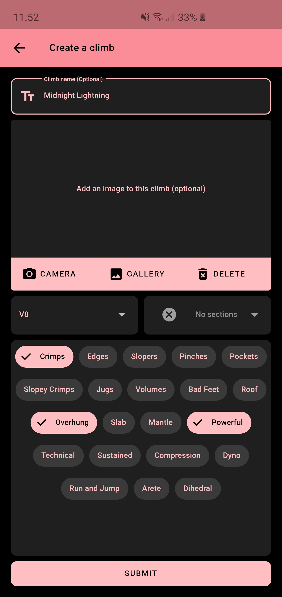

# sendrax

Easily log climbs and track progress indoors and out.

<p align="center">
  
</p>

This app aims to be a middle-ground between simple options like a spreadsheet or a journal
(which get difficult to manage when your log gets large and are frustrating to deal with between 
climb) and other software solutions like vertical life (which requires your gym's support) or one 
of many outdoor focused trackers which don't really work indoors.

With this app it's simple to create a location, fill it with climbs and track your attempts over any
timeframe. It works equally well outdoors where climbs are named and permanent and indoors where you
can archive a climb when it's taken down and replaced with something new.

This app was developed for my own personal use and as a learning experience in exploring flutter.
It has only been tested on android API level 29 and has a feature set dictated by what I've found
I want/need in my own climbing sessions.

## Download

The app will be made available for download after its first release.

## Build

The app has been developed on `flutter channel stable`.

Ensure that you have [flutter installed](https://flutter.dev/docs/get-started/install).

You will also have to set up a firebase project and add `google-services.json` for android and 
`GoogleService-Info.plist` for ios. Instructions for adding firebase to flutter can be 
[found here](https://firebase.google.com/docs/flutter/setup).

Then
```
git clone https://github.com/Meebuhs/sendrax
cd sendrax
flutter run
```

<p align="center">
  </br>
  <i>They've got some new kind of technique for televising opera </i>
</p>
